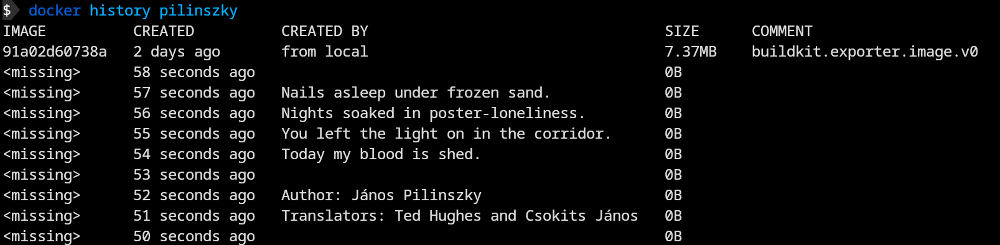

This repository contains a custom buildkitd frontend to encode poems (or any other texts) in Docker image history.

## Getting started

Create a `Poem` file (be sure that first line include the syntax)

```
# syntax=ghcr.io/elek/kolto

Nails asleep under frozen sand.
Nights soaked in poster-loneliness.
You left the light on in the corridor.
Today my blood is shed.

Author: János Pilinszky
Translators: Ted Hughes and Csokits János
```

Now you can build your image:

```
docker buildx build . -t pilinszky -f Poem
```

You can push/pull it. But when you need a poem, do:

```
docker history pilinszky
```

